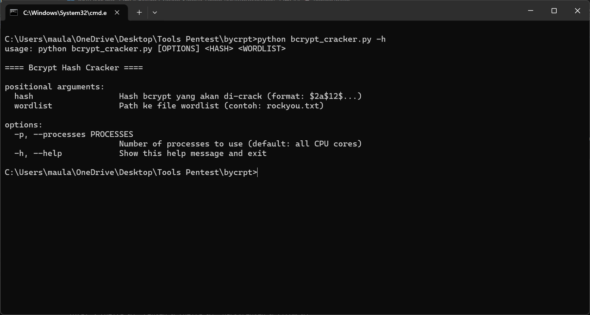
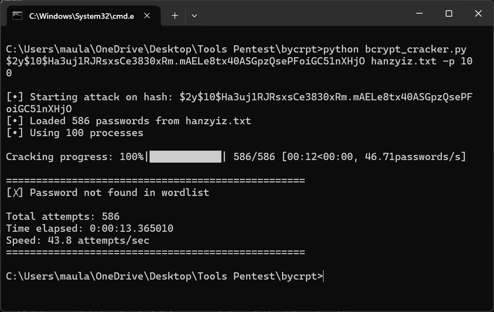

# Bcrypt Cracker


Sebuah tool command-line berbasis Python yang dirancang untuk melakukan serangan *brute-force* terhadap hash bcrypt secara efisien. Dibuat dengan modul `multiprocessing` untuk memanfaatkan semua core CPU yang tersedia, sehingga memberikan kecepatan cracking yang jauh lebih tinggi dibandingkan pendekatan single-thread atau multi-thread biasa.

## ✨ Fitur Utama

-   **Performa Tinggi:** Menggunakan `multiprocessing.Pool` untuk mendistribusikan beban kerja ke semua core CPU, melewati batasan Global Interpreter Lock (GIL) Python.
-   **Penggunaan CPU Efisien:** Secara otomatis menggunakan jumlah proses yang setara dengan jumlah core CPU untuk performa optimal.
-   **Antarmuka CLI Modern:** Dibuat dengan `argparse` untuk penggunaan yang mudah dan intuitif dari terminal.
-   **Laporan Progres Real-Time:** Menampilkan status serangan secara langsung, termasuk jumlah percobaan, persentase kemajuan, dan kecepatan (hash/detik).
-   **Penanganan Sinyal:** Dapat dihentikan dengan aman kapan saja menggunakan `Ctrl+C` tanpa menimbulkan error.
-   **Validasi Input:** Secara otomatis memeriksa format hash bcrypt untuk memastikan input yang valid.

## 📸 Tangkapan Layar




## ⚙️ Instalasi

1.  **Clone repository ini:**
    ```bash
    git clone [https://github.com/HanzYiz/bcrypt_cracker](https://github.com/HanzYiz/bcrypt_cracker)
    cd bcrypt_cracker
    ```

2.  **Install dependensi yang diperlukan:**
    ```bash
    pip install -r requirements.txt
    ```

## 🚀 Penggunaan

Jalankan skrip dari terminal dengan format perintah berikut:

```bash
python bcrypt_cracker.py <HASH> <PATH_WORDLIST> [OPTIONS]
python bcrypt_cracker.py '$2y$10$Ha3uj1RJRsxsCe3830xRm.mAELe8tx40ASGpzQsePFoiGC51nXHjO' rockyou.txt -p 100